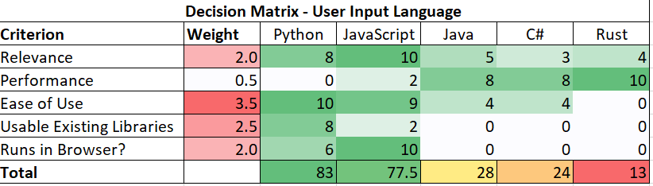
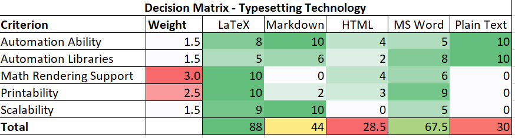
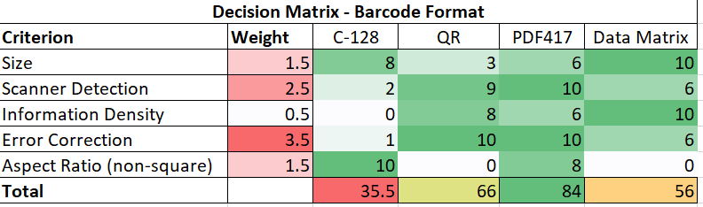

# Decision Matrices

These diagrams help clearly explain how we arrived at some of our critical design decisions. Decision matrices are a well known project management tool, so these diagrams indicate high quality computing and software design.

## Matrix 1 - User Input Language

This matrix determined the language that end-users of the software will use to create the automated generators for both problems and solution sets. The Python language was selected.

## Matrix 2 - Typesetting Technology

This matrix determined the typesetting technology that will be used both for generating printable copies of exams and for displaying fully worked out solutions to graders via the mobile app. The LaTeX typesetting language was selected.

## Matrix 3 - Barcode Format

This matrix determined the barcode format that will be used on exam pages enabling the mobile app to determine the problem seed for a particular exam. The PDF417 format was selected.

